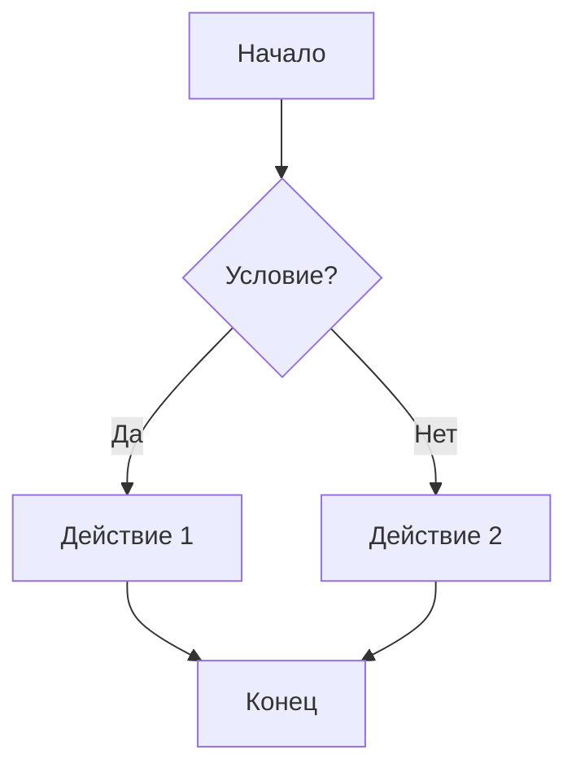
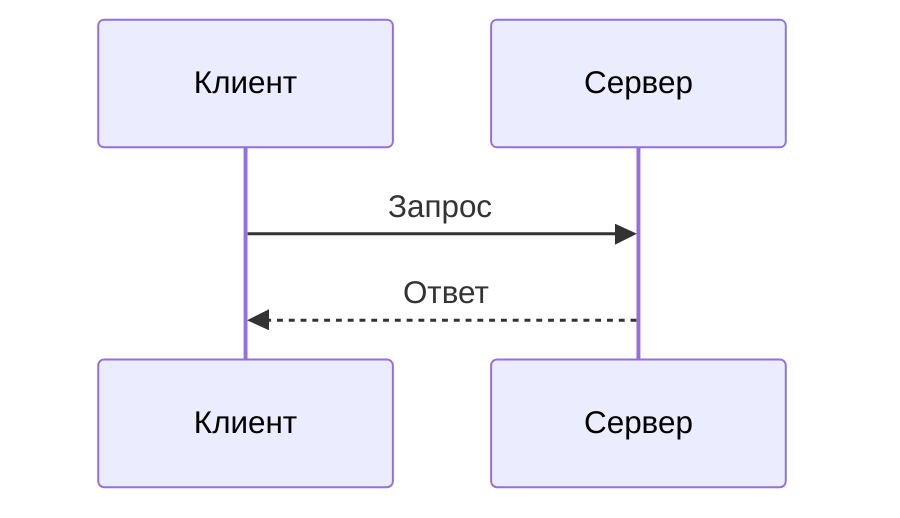

# Заголовок первого уровня

## Заголовок второго уровня

### Заголовок третьего уровня

#### Заголовок четвертого уровня

##### Заголовок пятого уровня

###### Заголовок шестого уровня

---

## Текстовое форматирование

Обычный текст, **жирный текст**, _курсивный текст_, **_жирный курсивный текст_**.

~~Зачеркнутый текст~~

`Инлайн код`

Текст с <u>подчеркиванием</u> и <mark>выделением</mark>.

## Списки

### Маркированный список

- Элемент 1
- Элемент 2
  - Вложенный элемент 2.1
  - Вложенный элемент 2.2
    - Глубоко вложенный элемент
- Элемент 3

### Нумерованный список

1. Первый элемент
2. Второй элемент
   1. Вложенный нумерованный элемент
   2. Еще один вложенный элемент
3. Третий элемент

### Список задач

- [x] Завершенная задача
- [ ] Незавершенная задача
- [x] Еще одна завершенная задача

## Ссылки

[Обычная ссылка](https://example.com)

[Ссылка с заголовком](https://example.com "Это заголовок ссылки")

<https://example.com>

email@example.com

## Изображения


## Блоки кода

```tsx
"use client";

import { useChat } from "@ai-sdk/react";
import { useState } from "react";
import { Streamdown } from "streamdown";

export default function Page() {
  const { messages, sendMessage, status } = useChat();
  const [input, setInput] = useState("");

  return (
    <>
      {messages.map((message) => (
        <div key={message.id}>
          {message.parts
            .filter((part) => part.type === "text")
            .map((part, index) => (
              <Streamdown key={index}>{part.text}</Streamdown>
            ))}
        </div>
      ))}

      <form
        onSubmit={(e) => {
          e.preventDefault();
          if (input.trim()) {
            sendMessage({ text: input });
            setInput("");
          }
        }}
      >
        <input
          value={input}
          onChange={(e) => setInput(e.target.value)}
          disabled={status !== "ready"}
          placeholder="Say something..."
        />
        <button type="submit" disabled={status !== "ready"}>
          Submit
        </button>
      </form>
    </>
  );
}
```

```python
def fibonacci(n):
    if n <= 1:
        return n
    return fibonacci(n-1) + fibonacci(n-2)

# Пример использования
for i in range(10):
    print(f"F({i}) = {fibonacci(i)}")
```

```css
.button {
  background-color: #007bff;
  border: none;
  color: white;
  padding: 12px 24px;
  text-align: center;
  text-decoration: none;
  display: inline-block;
  font-size: 16px;
  margin: 4px 2px;
  cursor: pointer;
  border-radius: 4px;
}
```

## Цитаты

> Это обычная цитата.
> Она может занимать несколько строк.

> ### Цитата с заголовком
>
> Это цитата с заголовком внутри.
>
> - Можно добавлять списки
> - И другие элементы

## Таблицы

| Заголовок 1    | Заголовок 2      | Заголовок 3 |
| -------------- | ---------------- | ----------- |
| Ячейка 1       | Ячейка 2         | Ячейка 3    |
| Длинная ячейка | **Жирный текст** | `код`       |
| Выравнивание   | по левому краю   | по центру   |

| Левый | Центр | Правый |
| :---- | :---: | -----: |
| Лево  | Центр |  Право |
| L     |   C   |      R |

## Горизонтальные линии

---

---

---

## HTML элементы

<details>
<summary>Раскрывающийся блок</summary>

Содержимое, которое можно скрыть/показать.

```javascript
console.log("Код внутри details");
```

</details>

<kbd>Ctrl</kbd> + <kbd>C</kbd>

H<sub>2</sub>O

X<sup>2</sup> + Y<sup>2</sup> = Z<sup>2</sup>

## Эмодзи

:smile: :heart: :thumbsup: :rocket: :fire: :100:

😀 😃 😄 😁 🚀 💯 ❤️ 👍

## Экранирование

\*Этот текст не курсивный\*

\`Это не код\`

\# Это не заголовок

## Сноски

Текст со сноской[^1].

Еще один текст со сноской[^note].

[^1]: Это первая сноска.
[^note]: Это именованная сноска с **форматированием**.

## Математические формулы

Инлайн формула: $E = mc^2$

Блочная формула:

$$
\int_{-\infty}^{\infty} e^{-x^2} dx = \sqrt{\pi}
$$

$$
\begin{matrix}
a & b \\
c & d
\end{matrix}
$$

## Определения

Термин 1
: Определение термина 1

Термин 2
: Определение термина 2
: Второе определение термина 2

## Аббревиатуры

_[HTML]: HyperText Markup Language
_[CSS]: Cascading Style Sheets

HTML и CSS являются основными технологиями веба.

## Предупреждения и заметки

> [!NOTE]
> Это заметка с важной информацией.

> [!WARNING]
> Это предупреждение о потенциальной проблеме.

> [!IMPORTANT]
> Это важная информация, которую нужно запомнить.

> [!TIP]
> Это полезный совет для пользователей.

> [!CAUTION]
> Будьте осторожны при выполнении этих действий.

## Специальные символы

© ® ™ § ¶ † ‡ • … ‰ ′ ″ ‹ › « » ¡ ¿

← ↑ → ↓ ↔ ↕ ↖ ↗ ↘ ↙

α β γ δ ε ζ η θ ι κ λ μ ν ξ ο π ρ σ τ υ φ χ ψ ω

## Диаграммы Mermaid





## Комментарии

<!-- Это комментарий, который не отображается -->

## Разрывы строк

Первая строка
Вторая строка (с двумя пробелами в конце предыдущей)

Первая строка\
Вторая строка (с обратным слешем)

Первая строка

Вторая строка (с пустой строкой между ними)
